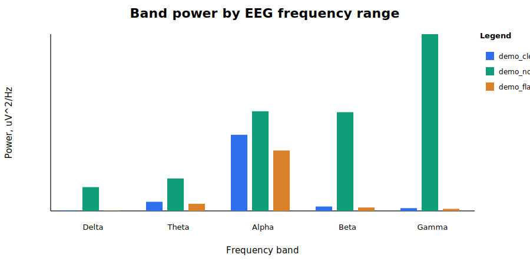
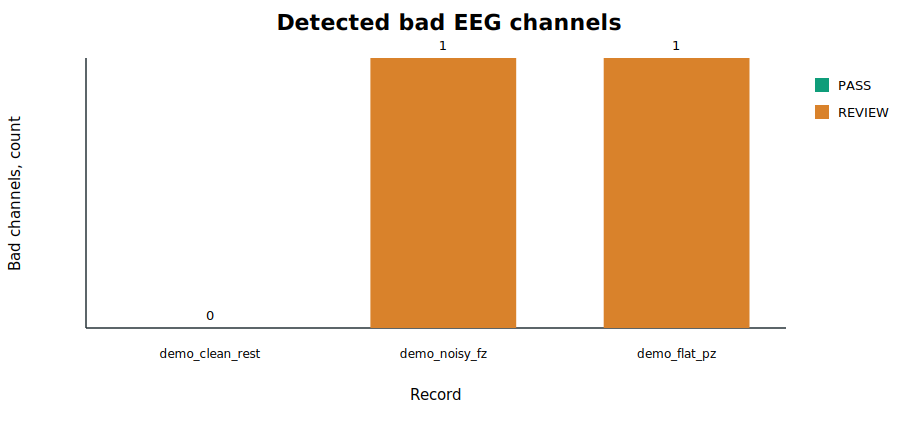

# Отчёт по прототипу QC ЭЭГ

**Тема:** QC / Quality Check анализ ЭЭГ-записей  
**Тип проекта:** программный прототип без нейронных сетей  
**Дата подготовки:** 29.05.2026  
**Репозиторий:** https://github.com/LevinAE/QC_EEG_PJCT

## 1. Цель работы

Цель работы - подготовить работающий прототип системы контроля качества ЭЭГ-записей. Прототип должен показывать основную идею проекта: запись ЭЭГ или EEG-подобный сигнал проходит через набор проверок, после чего система формирует таблицы, графики и итоговый отчёт. В текущей версии проект сделан как минимальный, но воспроизводимый MVP. Это значит, что его можно запустить без закрытых лабораторных данных и без сложной настройки окружения.

Полная система QC для ЭЭГ в дальнейшем должна работать с реальными BrainVision-файлами (`.vhdr`, `.eeg`, `.vmrk`), монтажами электродов, событиями, эпохами и отчётами MNE. В рамках промежуточного прототипа выбран более простой путь: используется синтетический EEG-подобный сигнал, на котором демонстрируются базовые проверки качества. Такой подход позволяет показать работающий конвейер уже сейчас и не зависеть от доступа к реальным данным.

Проект не использует нейронные сети, PyTorch, Keras или LLM. Поэтому требования про `torchinfo` и визуализацию архитектуры через Netron к текущей версии не применяются. Прототип относится к signal-processing подходу: он считает численные признаки сигнала и формирует отчёт по ним.

## 2. Ссылка на репозиторий и запуск

Работающий прототип размещён в GitHub-репозитории:

https://github.com/LevinAE/QC_EEG_PJCT

Основной запуск выполняется командой:

```powershell
python -m pip install -r requirements.txt
python -m qc_eeg demo --output reports/demo_run
```

После запуска создаются следующие файлы:

- `reports/demo_run/qc_results.csv` - таблица QC-метрик по записям;
- `reports/demo_run/test_results.csv` - таблица результатов тестирования;
- `reports/demo_run/band_power.svg` - график спектральной мощности по частотным диапазонам;
- `reports/demo_run/bad_channels.svg` - график количества проблемных каналов;
- `reports/demo_run/report.html` - HTML-отчёт, объединяющий таблицы и графики.

Для проверки тестов используется команда:

```powershell
python -m unittest discover -s tests
```

## 3. Реализованная функциональность

В текущей версии реализован демонстрационный режим `demo`. Он создаёт три EEG-подобные записи. Первая запись имитирует нормальный сигнал и используется как пример данных приемлемого качества. Вторая запись содержит шумный канал `Fz`. В этот канал добавлены сильный шум и компонент частоты 50 Гц, что имитирует технические или сетевые помехи. Третья запись содержит низкоамплитудный канал `Pz`, похожий на плоский или плохо зарегистрированный канал.

Для каждой записи рассчитываются общие параметры: длительность, частота дискретизации, число каналов, средняя абсолютная амплитуда, максимальная амплитуда, доминирующая частота и итоговый QC-статус. Также считается спектральная мощность в диапазонах Delta, Theta, Alpha, Beta и Gamma. Эти диапазоны используются в анализе ЭЭГ, потому что они помогают описывать частотную структуру сигнала и замечать аномалии.

На уровне каналов прототип проверяет амплитудные признаки. Если канал имеет слишком большую амплитуду или слишком большой разброс значений, он помечается как проблемный. Если канал почти плоский и имеет очень низкую амплитуду, он также помечается как проблемный. Итоговый статус записи формируется по числу найденных плохих каналов. Если плохих каналов нет, запись получает статус `PASS`. Если есть один или несколько проблемных каналов, запись отправляется на `REVIEW`.

Отдельно реализована отчётность. Прототип сохраняет результаты в CSV-таблицы, строит SVG-графики и создаёт HTML-отчёт. Это важно, потому что QC должен быть не только расчётом внутри кода, но и понятным результатом, который можно показать руководителю, приложить к отчёту или использовать для сравнения запусков.

## 4. Текущее состояние разработки

Текущий прототип является рабочим минимальным вариантом. Он не обрабатывает реальные лабораторные файлы напрямую, но показывает ключевую структуру будущей системы: входные данные, расчёт признаков качества, маркировка проблемных каналов, сохранение таблиц, построение графиков и формирование отчёта.

Главное преимущество текущей версии - воспроизводимость. Для запуска не нужны закрытые ЭЭГ-записи, индивидуальные монтажи, внешняя библиотека `eeg_auto_tools` или установленный MNE. Достаточно Python и NumPy. Это делает прототип удобным для промежуточной демонстрации: основные функции действительно запускаются, а результаты уже лежат в репозитории.

Ограничение текущей версии состоит в том, что синтетические данные не заменяют проверку на реальных ЭЭГ-записях. Они нужны только для демонстрации логики и проверки работоспособности. Следующий этап разработки должен вернуть полноценную обработку BrainVision-данных: чтение `.vhdr/.eeg/.vmrk`, проверку связей между файлами, применение монтажа `.elc`, построение `mne.Report`, подключение FASTER и расширение QC до событий, эпох и ICA-компонент.

## 5. Таблицы с результатами

### Таблица 1. Сводные QC-метрики по демонстрационным записям

**Источник данных:** `reports/demo_run/qc_results.csv`, синтетические EEG-подобные записи из демонстрационного запуска.

| Запись | Сценарий | Длительность, с | Частота, Гц | Каналов | Плохие каналы | Число плохих каналов | Средняя амплитуда, µV | Alpha/Beta | QC-статус |
|---|---:|---:|---:|---:|---|---:|---:|---:|---|
| `demo_clean_rest` | Rest | 12.0 | 250.0 | 5 | - | 0 | 12.68 | 17.26 | PASS |
| `demo_noisy_fz` | Rest | 12.0 | 250.0 | 5 | Fz | 1 | 25.30 | 1.01 | REVIEW |
| `demo_flat_pz` | Rest | 12.0 | 250.0 | 5 | Pz | 1 | 10.10 | 17.67 | REVIEW |

Таблица показывает, что чистая запись проходит проверку, а записи с искусственно добавленными проблемами получают статус `REVIEW`. Для шумной записи найден канал `Fz`, для плоской записи найден канал `Pz`.

### Таблица 2. Результаты тестирования прототипа

**Источник данных:** `reports/demo_run/test_results.csv` и автоматические тесты из `tests/test_metrics.py`.

| Проверка | Данные | Ожидаемый результат | Фактический результат | Статус |
|---|---|---|---|---|
| Clean record keeps PASS status | `demo_clean_rest` | PASS | PASS | PASS |
| Noisy Fz record is flagged | `demo_noisy_fz` | Fz in bad_channels | Fz | PASS |
| Flat Pz record is flagged | `demo_flat_pz` | Pz in bad_channels | Pz | PASS |

Тесты подтверждают, что базовые сценарии работают ожидаемо. Прототип отличает нормальную запись от записи с шумным каналом и от записи с низкоамплитудным каналом.

## 6. Графики и диаграммы

### Рисунок 1. Спектральная мощность по частотным диапазонам

**Источник данных:** `reports/demo_run/band_power.svg`, построен по результатам демонстрационного запуска.  
**Ось X:** частотные диапазоны Delta, Theta, Alpha, Beta, Gamma.  
**Ось Y:** мощность сигнала.  
**Легенда:** идентификаторы демонстрационных записей.



График показывает различия между записями по частотным диапазонам. У чистой записи сохраняется выраженная альфа-составляющая, а у шумной записи заметно растёт мощность в высокочастотной области.

### Рисунок 2. Количество проблемных каналов

**Источник данных:** `reports/demo_run/bad_channels.svg`, построен по результатам демонстрационного запуска.  
**Ось X:** демонстрационные записи.  
**Ось Y:** количество проблемных каналов.  
**Цвет:** итоговый QC-статус записи.



График показывает, что у чистой записи нет проблемных каналов, а у двух записей с искусственно добавленными дефектами найдено по одному проблемному каналу.

## 7. Краткий анализ результатов

Промежуточные результаты соответствуют поставленной задаче для минимального прототипа. Репозиторий опубликован на GitHub, основные функции запускаются, результаты сохраняются в таблицы, строятся два графика и создаётся HTML-отчёт. Это закрывает основное требование к работающему прототипу.

Работает следующая часть системы: генерация демонстрационных сигналов, расчёт амплитудных признаков, расчёт спектральной мощности, определение проблемных каналов, формирование статуса записи, экспорт CSV, построение SVG-графиков, создание HTML-отчёта и автоматическое тестирование. Эти функции являются базой для дальнейшего QC-пайплайна.

Требует доработки обработка реальных данных. В следующей версии нужно подключить MNE и вернуть чтение BrainVision-файлов, потому что именно такой формат используется в исходном прототипе. Также нужно добавить проверку событийной разметки, анализ эпох, ICA-компоненты и отчёты MNE. Эти блоки уже описаны в литературном и методологическом обзорах, но в текущий минимальный MVP они не включены, чтобы не сделать прототип нестабильным.

Отдельно стоит отметить, что отсутствие нейронных сетей является осознанным решением. Для данной промежуточной версии достаточно классического signal-processing подхода. Он проще для запуска, легче объясняется и лучше подходит для демонстрации базового QC. Если позднее будет принято решение добавлять ML или нейросетевой блок, тогда потребуется отдельное описание архитектуры, `torchinfo` и экспорт модели в Netron.

## 8. Вывод

В результате работы подготовлен минимальный, но работающий прототип QC для ЭЭГ. Он размещён в GitHub-репозитории, запускается через CLI, формирует две таблицы, два графика и HTML-отчёт. Прототип показывает базовую идею контроля качества: запись анализируется по численным признакам, проблемные каналы выделяются автоматически, а результат сохраняется в удобном для проверки виде.

Текущая версия подходит для промежуточной сдачи практики. Она честно показывает состояние разработки: базовый конвейер уже работает, но полноценная обработка реальных ЭЭГ-записей остаётся следующим этапом.
